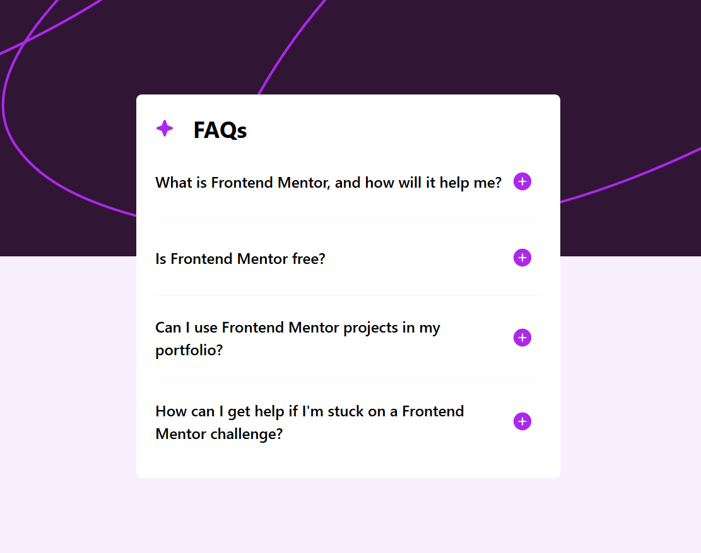

# Frontend Mentor - FAQ accordion solution

This is a solution to the [FAQ accordion challenge on Frontend Mentor](https://www.frontendmentor.io/challenges/faq-accordion-wyfFdeBwBz). Frontend Mentor challenges help you improve your coding skills by building realistic projects. 

## Table of contents

- [Overview](#overview)
  - [The challenge](#the-challenge)
  - [Screenshot](#screenshot)
  - [Links](#links)
- [My process](#my-process)
  - [Built with](#built-with)
  - [What I learned](#what-i-learned)
- [Author](#author)

## Overview

### The challenge

Users should be able to:

- Hide/Show the answer to a question when the question is clicked
- Navigate the questions and hide/show answers using keyboard navigation alone
- View the optimal layout for the interface depending on their device's screen size
- See hover and focus states for all interactive elements on the page

### Screenshot

### Links

- Live Site URL: [https://kirlosbasta.github.io/faq-accordion/](https://kirlosbasta.github.io/faq-accordion/)

## My process

### Built with

- Semantic HTML5 markup
- Flexbox
- CSS Grid
- Mobile-first workflow
- Tailwind CSS
- [React](https://reactjs.org/) - JS library

### What I learned

I learned how to create an accordion component using React. I implemented state management to handle the visibility of answers when questions are clicked. I also practiced using Tailwind CSS for styling, which allowed me to quickly apply responsive design principles.

## Author

- Frontend Mentor - [@kirlosbasta](https://www.frontendmentor.io/profile/kirlosbasta)
- GitHub - [@kirlosbasta](https://github.com/kirlosbasta)
